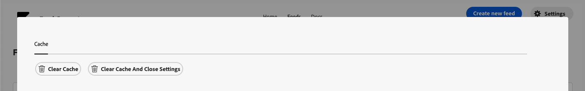

# Comwrap Feed Generator

Feed Generator is a service that simplifies the process of generating product feeds. It ensures that you can easily integrate your store with various systems. With just a few configuration steps you can generate a feed that can be consumed by third-party marketplaces like Google and Facebook — or that can be used for integrating with any other third-party system. Currently module supports XML feed format. Another formats will come in the future.

## Installation

Please see [INSTALL.md](INSTALL.md) for more details.

## Home page / Grid

On the application home page you will see list of the feeds:


For each feed you can: 

* Edit Feed
* Delete Feed

On a feed list you can find: 

* Feed name
* UUID of the feed
* Adobe Commerce Store to be used
* File that being generated
* Date of feed creation
* Date of feed generation
* Type of the feed
* Status of the feed: 

* **Pending - nothing yet happened with the feed, it just was created OR edited**
* **In Process - generation is currently in progress**
* **Generated - Feed it ready to be used**

If during feed generation an error occurs, you can see an error in the grid.


## Edit Feed

On a Grid page you can click on a Feed name, and you will be landed on Edit page of selected feed: 


Here you can change the following elements: 

| Field Name            | Description                                                                 |
|-----------------------|-----------------------------------------------------------------------------|
| Feed Name             | Name of the feed (will be used only on application UI)                      |
| Feed Type             | Type of the feed:                                                           |
|                       | - XML                                                                       |
|                       | - CSV - Coming in future releases                                           |
|                       | - JSON - Coming in future releases                                          |
| Adobe Commerce Store  | Store of your AC system. Products data from selected store will be used.    |
| Feed Header           | Header of the feed. *                                                       |
| Item Body             | Body of the single feed element                                             |
| Feed Footer           | Footer of the feed *                                                        |

* Feed will be generated as following: Header + All Items + Footer

### Feed Body

Variables can be used for the feed body. These variables represent the GraphQL schema being used (by default, it is the Adobe Commerce schema).

Example:

```graphql
products(search: "test", pageSize: 2) 
{
  items
  {
    name
    description
    image {
      url
    }
    description {
      html
    }
    price_range {
      minimum_price {
        regular_price {
          value
          currency
        }
      }
    }
  }
}
```

Based on this GQL schema you can use the following variables (starting inside of the “items“ schema): 

* {{name}}
* {{description}}
* {{image.url}}
* {{description.html}}
* {{price_range.minimum_price.regular_price.value}}
* {{price_range.minimum_price.regular_price.currency}}

… and so on depends on a schema used

### Filtering

Without applying filters, the system will attempt to fetch all available products for the selected store. To narrow down the selection, you can apply custom filters.


#### Search

In the search field, you can enter any search term, and it will be applied to the GraphQL "products" query as a search parameter. 

```
query {
  products(
    search:"Tank"
  ) {
    items {
      sku
      name
  }
}
```

#### Filter Configuration

If you want to apply GraphQL filters, you can paste JSON that will be converted into a standard GraphQL filter. 

As example, from 

```
{
  "category_id": {
    "eq": "26"
  }
}
```

to

```
 query {
  products(
    filter: { category_id: { eq: "26" } }
  ) {
    items {
      sku
      name
  }
}
```

### Scheduling

You can configure how often feed can be updated.

In "Manual" mode, feed will be updated only by clicking "Regenerate Feed"


In "By Schedule" mode, feed will be automatically updated at defined time.


## Settings

GraphQL schema loaded from Adobe Commerce is cached by the module. So if you change schema on Adobe Commerce side, you have to update the cache.
For that go to Settings and click on clean the cache button.



### Placeholders

#### Fixed Variables

Header and Footer currently have a support to variables (Only 1 actualy)

`{{DATA}}` - Current Date/Time - will be in format 2024-10-21T14:45:30.123Z

### Dynamic variables

Variables are defined using double curly braces (`{{ }}`) and correspond to fields in the Magento GraphQL product output. For example, `{{sku}}` will be replaced with the product's SKU.

##### Additonal parameters

###### Repeating Tags with `count`

When a variable corresponds to an array, you can use the `count` property to repeat the XML tag for each element in the array. For instance, using `count=5` will generate up to 5 tags, each containing a different value from the array.

```xml
<g:brand count=5>{{manufacturer}}</g:brand>
```

##### Selecting Specific Array Elements with `index`

To select a specific element from an array, use the `index` property. This will generate a single tag with the value of the specified element from the array.

```xml
<g:product_type index=2>{{categories.name}}</g:product_type>
```

#### Example 

```xml
<item>
  <g:id>{{sku}}</g:id>
  <title>{{name}}</title>
  <description>{{description.html}}</description>
  <link>https://www.native-instruments.com/{{detail_page}}</link>
  <g:image_link>{{image.url}}</g:image_link>
  <g:condition>new</g:condition>
  <g:price>{{price_range.maximum_price.final_price.value}} {{price_range.maximum_price.final_price.currency}}</g:price>
  <g:availability>In Stock</g:availability>
  <g:google_product_category><![CDATA[Arts &amp; Entertainment &gt; Hobbies &amp; Creative Arts &gt; Musical Instruments &gt; Electronic Musical Instruments]]></g:google_product_category>
  <g:identifier_exists>true</g:identifier_exists>
  <g:product_type index=2>{{categories.name}}</g:product_type>
  <g:sale_price>{{price_range.minimum_price.final_price.value}}</g:sale_price>
  <g:brand count=5>{{manufacturer}}</g:brand>
  <g:mpn>{{sku}}</g:mpn>
  <g:additional_image_link><![CDATA[{{image.url}}?width=350&height=350&fit=crop]]></g:additional_image_link>
</item>
```

## Technical Module implementation

Delete Feed - deleting current feed from the database and from all schedules

Regenerate Feed - will trigger the event “generate.feed” for a particular feed ID. This event will initiate an action that creates a new feed.

### app.config.yaml

- List of all actions currently developed: `app.config.yaml`

* `saveFeed` - save the feed action. Action being invoked after user submit feed form. 

  Saving feed into key/value storage. Key for the feeds have to looks like following: `feed-UUID`.

* `deleteFeed` - delete the feed action. Action being invoked after user click on Delete button 

  Deleting the feed from storage by UUID

* `getAllFeeds` - retrieve all feeds from the key/value storage and deliver JSON back. Invoked on dashboard while loading.

  Retrieve all available feeds from the storage. Will be used by Dashboard to render feeds list.

* `getFeedByUuid` - retrieve single feed by UUID

* `regenerateFeed` - trigger feed generation. Will place a new event, that feed generation have to be started.

  Creating new Event on adobe I/O. Event name: `feed.generate`.
  This event means "Please start Force Regeneration to required feed UUID"

* `processGeneration` - process generation action. Regenerate required feed. Currently ID is hardcoded

  Action will be invoked when `feed.generate` event added.

* `getGqlSchema` - retrieve graphql schema from target magento app.

* `getAllStores` - get all Magento stores by API

* `generateByCron` - trigger feed generation by OpenWisk alarms. 

Action is running every 30 minutes and checking by feed settings if it have to be regenerate. Process regeneration if necessary.

### Web elements

* `index.html` - Dashboard of the project.

  List of Feeds already saved (currently list of feeds received from Action by ajax request). Incl. paginator.
        
  * Button to Create New Feed
  * Every already saved feed have to have a following action:
    * Edit Feed
    * Delete Feed
  *  Force Feed Regeneration

  Edit / Create New Feed form will contain form to save new Feed.

  Current elements: 
  * Feed Format - select - JSON | XML
  * Feed Item: Big text field to have XML | JSON there with feed item body
  * Feed Header
  * Feed Footer
  * Store View - select with list of available store views on Magento (websites also have to be there, but it is not possible to select them)
  
  After saving the form, it saved into key/value storage and user have to be redirected to dashboard. Success message have to be shown there.

  In case of error, error have to be displayed


### Frontend Libraries

## Auto complete

For Text area autocompletion this library was used: 
https://github.com/zurb/tribute

